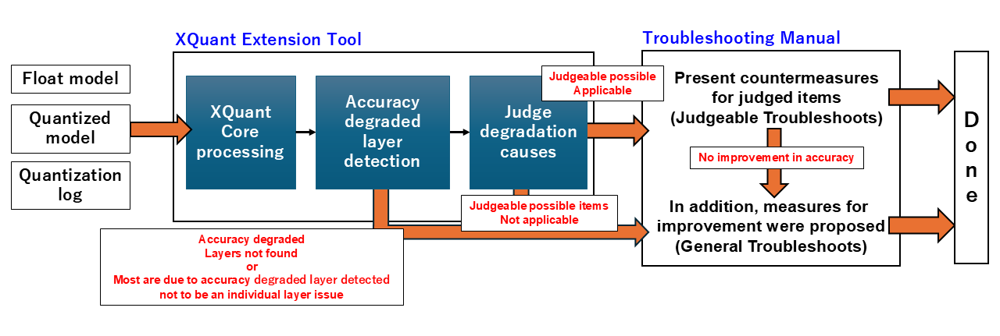
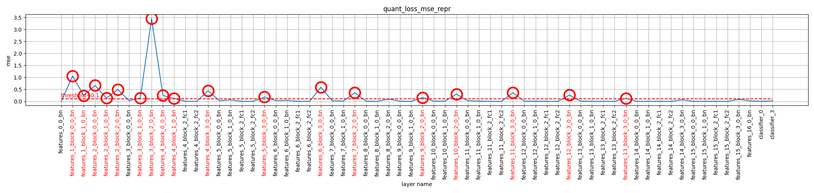
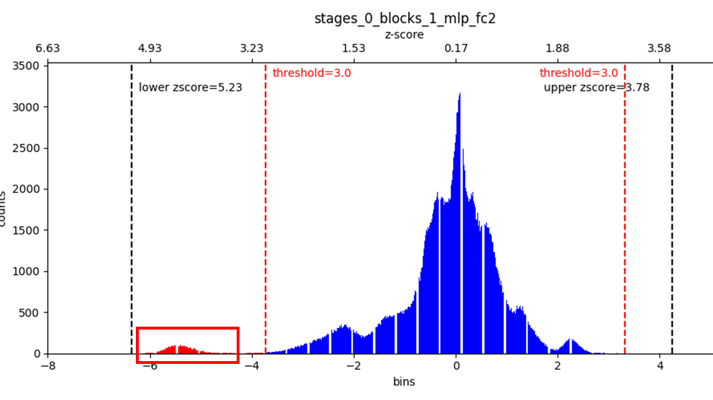

===============================
XQuant Extension Tool
===============================
About XQuant Extension Tool
===============================
This tool calculates the error for each layer by comparing the float model and quantized model, using both models along with the quantization log. The results are presented in reports. It identifies the causes of the detected errors and recommends appropriate improvement measures for each cause. The following are the main components of the XQuant functional extension tool.

* Troubleshooting Manual

 A document that outlines judgment methods and countermeasures for accuracy degradation, based on existing troubleshooting documentation.

* XQuant Extension Tool 

 A tool that connects layers identified as having degraded accuracy to the relevant improvement manual and outputs the results.

Overall Process Flow
============================

The overall process follows the steps below:

1. Input the float model, quantized model, and quantization log.
2. Detect layers in which accuracy has degraded due to quantization.
3. Judge degradation causes on the detected degraded layers.
4. Based on the judge results, individual countermeasure procedures or general improvement measures are proposed from the troubleshooting manual.

Additionally, in the cases highlighted in red below, general improvement measures will be suggested instead of specific countermeasures for each item judged.

* When no degraded layers can be found
* When the majority of layers are identified as degraded and the issue is judged not to be with individual layers
* When judging accuracy as degraded and none of the judge items apply
* When accuracy does not improve after applying the proposed judgment countermeasures

Please refer to the attached link for the items to be judged in detail.

How to Run
===============

| For instructions on how to execute, please refer to the link attached.
| This XQuant Extension Tool was created based on xquant, as shown in the link below. In addition to the conventional xquant functions, it is linked to a troubleshooting manual and provides appropriate countermeasures for each cause of degration.

| It can suggest more specific countermeasures than conventional tools and provides manuals that are easy to understand even for users who are not familiar with quantization.

When runnnig the tool, replace **xquant_report_pytorch_experimental** in the code with **xquant_report_troubleshoot_pytorch_experimental** in the tutorial of XQuant (Explainable Quantization). 

.. code-block:: python

    from model_compression_toolkit.xquant import xquant_report_troubleshoot_pytorch_experimental
    # xquant_report_pytorch_experimental --> xquant_report_troubleshoot_pytorch_experimental
    result = xquant_report_troubleshoot_pytorch_experimental(
                float_model,
                quantized_model,
                random_data_gen,
                validation_dataset,
                xquant_config
            )

| When running XQuant, execute the steps in the following order: 

1. mct.set_log_folder
2. mct.ptq.pytorch_post_training_quantization
3. XQuantConfig
4. xquant_report_troubleshoot_pytorch_experimental

.. code-block:: python

    mct.set_log_folder('./log/dir/path')

    quantized_model, quantized_info = mct.ptq.pytorch_post_training_quantization(
        in_module=float_model, representative_data_gen=random_data_gen)

    xquant_config = XQuantConfig(report_dir='./log_tensorboard_xquant')

    from model_compression_toolkit.xquant import xquant_report_troubleshoot_pytorch_experimental
    result = xquant_report_troubleshoot_pytorch_experimental(
                float_model,
                quantized_model,
                random_data_gen,
                validation_dataset,
                xquant_config
            )

| The log for TensorBoard is generated in the folder path set by *mct.set_log_folder*. 

.. note::

  If log for TensorBoard does not exist, the *Unbalanced Concatnation* described below will not be executed.

XQuantConfig Format and Examples
======================================

When running XQuant, the parameters can be set as shown in the table below.

.. list-table:: XQuantConfig parameter
   :header-rows: 1
   :widths: 15 15 50 20

   * - input parameter
     - type
     - details
     - initial value

   * - report_dir
     - str
     - Directory where the results will be saved. **[Necessary]**
     - ``-``

   * - custom_similarity_metrics
     - dict[str, Callable]
     - User-specified quantization error metric calculation functions. str: metric name, Callable: function to calculate the metric.
     - None

   * - quantize_reported_dir
     - str
     - Directory where the the quantization log will be saved. If not specified, the path set with *mct.set_log_folder* will be used.
     - Most recently set value in mct.set_log_folder

   * - threshold_quantize_error
     - dict[str, float]
     - Threshold values for detecting degradation in accuracy.
     - {"mse":0.1, "cs":0.1, "sqnr":0.1}

   * - is_detect_under_threshold_quantize_error
     - dict[str, bool]
     - For each threshold specified in threshold_quantize_error, True: detect the layer as degraded when the error is below the threshold.; False: detect the layer as degraded when the error is above the threshold (Not required if custom metrics are not set).
     - {"mse":False, "cs":True, "sqnr":True}

   * - threshold_degration_layer_ratio
     - float
     - If the number of layers detected as degraded is large, skips the judge degradation causes Specify the ratio here.
     - 0.5

   * - threshold_zscore_outlier_removal
     - float
     - Used in judge degradation causes (Outlier Removal). Threshold for z_score to detect outliers.
     - 5.0

   * - threshold_ratio_unbalanced_concatnation
     - float
     - Used in judge degradation causes (unbalanced “concatnation”). Threshold for the multiplier of range width between concatenated layers.
     - 16.0

   * - threshold_bitwidth_mixed_precision
       _with_model_output_loss_objective
     - int
     - Used in judge degradation causes (Mixed precision with model output loss objective). Bitwidth of the final layer to judge insufficient bitwidth.
     - 2

You can configure each parameter by calling the XQuantConfig class as shown below.

.. code-block:: python

    XQuantConfig(report_dir: str,
            custom_similarity_metrics: Dict[str, Callable] = None,
            quantize_reported_dir: str = None,
            threshold_quantize_error: Dict[str, float] = {"mse": 0.1, "cs": 0.1, "sqnr": 0.1},
            is_detect_under_threshold_quantize_error: Dict[str, bool] = {"mse": False, "cs": True, "sqnr": True},
            threshold_degrade_layer_ratio: float = 0.5,
            threshold_zscore_outlier_removal: float = 5.0,
            threshold_ratio_unbalanced_concatenation: float = 16.0,
            threshold_bitwidth_mixed_precision_with_model_output_loss_objective: int = 2
            ):

Understanding the Quantization Error Graph
=============================================================

| Quantization error graphs are generated for three calculation methods (mse, cs, sqnr) and two datasets (representative and validation), resulting in six graphs in total.
| These graphs are saved in the directory specified by the XQuantConfig's report_dir.

* **X-axis**: Layer names (layers identified as degraded are highlighted in red)
* **Y-axis**: Quantization error
* **Red dashed line**: Threshold for accuracy degradation as set in XQuantConfig
* **Red circle**: Layers judged to have degraded accuracy

| As an example, an output graph calculated using "mse" with a representative dataset is shown.
| The initial threshold value of 0.1 is set, and layers exceeding this threshold are indicated with a red circle. In addition, the corresponding layer names on the X axis are highlighted in red. With this graph, layers with accuracy degradation can be visually confirmed.

Understanding the judgment result
============================================

Outlier Removal
-----------------

| In outlier removal, values exceeding the threshold set in XQuantConfig's threshold_zscore_outlier_removal are detected.
| The console displays a message stating that there are output values that deviate significantly from the average, and refers you to the Troubleshooting Manual's “Outlier Removal” section.
| It also lists the histogram save paths for the layers containing the detected outliers.
| The histograms are saved in a directory named “outlier_histgrams” created in the path specified by **report_dir** in **XQuantConfig**.

::

    WARNING:Model Compression Toolkit:There are output values ​​that deviate significantly from the average. Refer to the following images and the TroubleShooting Documentation (MCT XQuant Extension Tool) of 'Outlier Removal'.
    WARNING:Model Compression Toolkit:./log_tensorboard_xquant/outlier_histgrams/stem_2_conv_kxk_0_conv_bn.png
    WARNING:Model Compression Toolkit:./log_tensorboard_xquant/outlier_histgrams/stages_0_blocks_0_token_mixer_mixer_conv_scale_conv_bn.png
    WARNING:Model Compression Toolkit:./log_tensorboard_xquant/outlier_histgrams/stages_0_blocks_0_token_mixer_mixer_conv_kxk_0_conv_bn.png
    ・
    ・
    ・

| Next, we will move on to explaining the output histogram.

* **First X-axis(lower part)**: Indicates bins that finely divide the range of data values.
* **Second X-axis(upper part)**: Shows the z-score values corresponding to the primary X-axis.
* **Red dashed line**: The z-score threshold set in XQuantConfig.
* **Black dashed line**

  * **Lower zscore**: Indicates the maximum value on the lower side of the histogram.
  * **Upper zscore**: Indicates the maximum value on the upper side of the histogram.

| An example of a histogram detected by Outlier Removal is shown.
| In this example, outliers appear in the range from about 3.9 to 5.3 on the lower end of the z-score.
| Therefore, setting the z-score threshold to 3.9 will allow these outliers to be removed.

| By setting the threshold confirmed using the XQuant extension tool as an argument when executing **mct.ptq.pytorch_post_training_quantization** as follows, it is possible to remove outliers.

.. code-block:: python

    core_config = mct.core.CoreConfig(mct.core.QuantizationConfig(z_threshold=3.9))
    quantized_model, quantized_info = mct.ptq.pytorch_post_training_quantization(in_module=float_model,
                                                                                representative_data_gen=random_data_gen,
                                                                                core_config=core_config)

Shift Negative Activation
------------------------------

| Shift Negative Activation is detected when a default activation layer is present in the model.  
| The console will display a message indicating that such a layer has been found and recommend you consult the “Shift Negative Activation” section of the troubleshooting manual.

| The detected activation layers will also be listed.

| Please refer to the troubleshooting manual for further details.

::

    WARNING:Model Compression Toolkit:There are activations that contain negative values. Refer to the troubleshooting manual of "Shift Negative Activation".
    WARNING:Model Compression Toolkit:stem_0_act=GELU
    WARNING:Model Compression Toolkit:stem_1_act=GELU
    WARNING:Model Compression Toolkit:stem_2_act=GELU
    ・
    ・
    ・

Unbalanced Concatnation
---------------------------

| For unbalanced concatenation, the value ranges of each concatenated layer are calculated.
| If the difference in range width exceeds the threshold set in XQuantConfig's threshold_ratio_unbalanced_concatnation, it is considered unbalanced.
| The console will display a message indicating detection of unbalanced concatenation and suggest consulting the “Unbalanced Concatenation” section of the troubleshooting manual.
| Additionally, the names of the relevant layers and the recommended scaling factor are displayed.

::

    WARNING:Model Compression Toolkit:There are unbalanced range layers concatnated. Refer to the troubleshooting manual of 'Unbalanced "concatenation"'.
    WARNING:Model Compression Toolkit:first layer:features.15.conv.2, second layer:features.15.conv.3, if you add a scaling operation, recommended scaling:first layer * 5.758747418625537
    WARNING:Model Compression Toolkit:first layer:features.16.conv.2, second layer:features.16.conv.3, if you add a scaling operation, recommended scaling:first layer * 6.228137651975462
    ・
    ・
    ・

| To resolve unbalanced concatenation, there are two methods: disable optimization for some graphs as shown below, or apply a multiplier to the layer before concatenation as shown in the console.

| For details, refer to the troubleshooting manual.

.. code-block:: python

    core_config = mct.core.CoreConfig(mct.core.QuantizationConfig(linear_collapsing=False,
                                                              residual_collapsing=False))
    quantized_model, _ = mct.ptq.pytorch_post_training_quantization(...,
                                                                    core_config=core_config)

Mixed Precision with model output loss objective
------------------------------------------------------------

| In Mixed Precision with model output loss objective, output is generated when the bit width of the final layer is less than or equal to the threshold (default: 2).
| If the quantization bit width of the last layer is unusually small, the console will display a message recommending you refer to the troubleshooting manual’s “Mixed Precision with model output loss objective” section.

::

    WARNING:Model Compression Toolkit:the quantization bitwidth of the last layer is an extremely small number. Refer to the troubleshooting manual of 'Mixed Precision with model output loss objective'.

