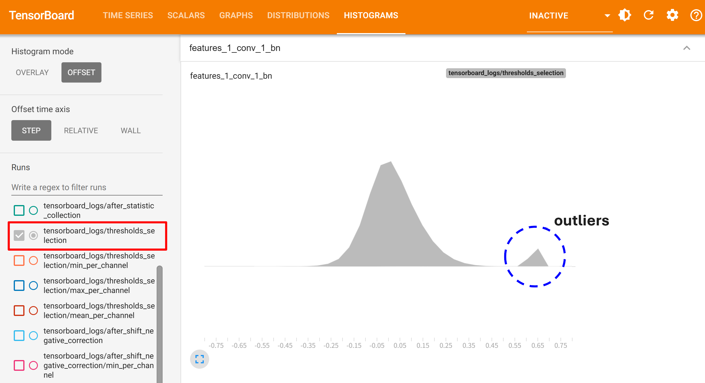

:orphan:

.. _ug-outlier_removal:

================
Outlier Removal
================

Overview
==============================
Outlier removal can become essential when quantizing activations, particularly in scenarios where certain layers produce output activation tensors with skewed value distributions.

Such outliers can mess up the selection of quantization parameters.

Trouble Situation
==============================
The quantization accuracy may degrade when there are outlier activations in the quantized layers of your model.

For example, you can check if activation tensors have outliers by visualizing the histograms in TensorBoard(**thresholds_selection** in the below image).

Solution
=================================
Manually limit the activation thresholds using the ``z_threshold`` attribute of ``QuantizationConfig`` in ``CoreConfig``.

Set ``z_threshold`` to a value. Typical value range is between 5.0 and 20.0.

.. code-block:: python

    core_config = mct.core.CoreConfig(mct.core.QuantizationConfig(z_threshold=8.0))
    quantized_model, _ = mct.ptq.pytorch_post_training_quantization(..., core_config=core_config)
